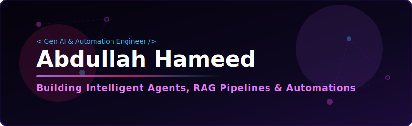

<div align="center">

<!-- Custom SVG Header hosting locally to avoid XML parse and overlapping errors -->


<br/><br/>


<br/>


</div>

<br/>

## 🧑‍💻 Who I Am

```typescript
const abdullahHameed = {
  role: "CS Graduate | Aspiring Gen AI & Automation Engineer",
  stack: ["Python", "SQL", "RAG", "LangChain", "AI/ML"],
  focus: ["LLM Orchestration", "Agentic Workflows", "Automation Pipelines"],
  status: "Open to collaboration on Gen AI & automation projects",
  interests: ["Generative AI", "Multi-Agent Systems", "Full-Stack AI Apps"]
};
```

## 🚀 Featured Projects

<table width="100%">
  <tr>
    <td width="50%" valign="top">
      <h3>📸 Event Photo Matching</h3>
      <p align="left">Event photo face-matching web app where attendees upload a selfie to instantly find all matching event photos, powered by AWS Rekognition and S3.</p>
      <p>
        <a href="https://eventphoto-matching-app.vercel.app"><b>🌐 Live Demo</b></a> &nbsp;|&nbsp; 
        <a href="https://github.com/Abdullahameed/event-photo-matching"><b>💻 Code</b></a>
      </p>
      
      
      
    </td>
    <td width="50%" valign="top">
      <h3>🧠 MindCare AI Chatbot</h3>
      <p align="left">An AI-powered mental health chatbot utilizing Retrieval-Augmented Generation (RAG) and LangChain for highly contextual and supportive conversations.</p>
      <p>
        <a href="https://mindcare-ai-chatbot.vercel.app/"><b>🌐 Live Demo</b></a> &nbsp;|&nbsp; 
        <a href="https://github.com/Abdullahameed/mindcare-ai-chatbot"><b>💻 Code</b></a>
      </p>
      
      
      
    </td>
  </tr>
</table>

## 🛠️ Tech Stack & Skills

<div align="center">

[](https://skillicons.dev)

<br/>


</div>

## 📊 GitHub Stats

<div align="center">


<br/>


</div>

## 🏆 GitHub Trophies

<div align="center">

</div>

## 📈 Contribution Graph

<div align="center">

</div>

## 🔗 Connect With Me

<div align="center">

<a href="https://www.linkedin.com/in/abdullah-sh-105a9741a/"></a>
<a href="mailto:abdullah.uos.sheikh@gmail.com"></a>

</div>

<br/>


